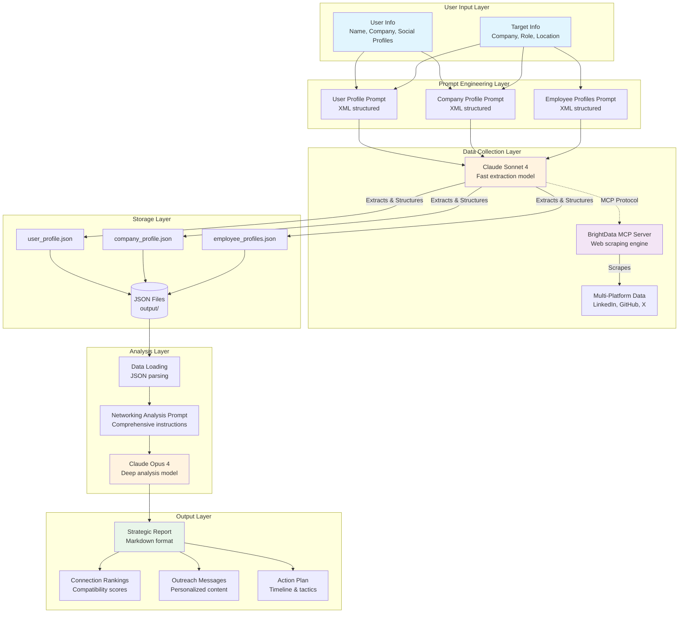
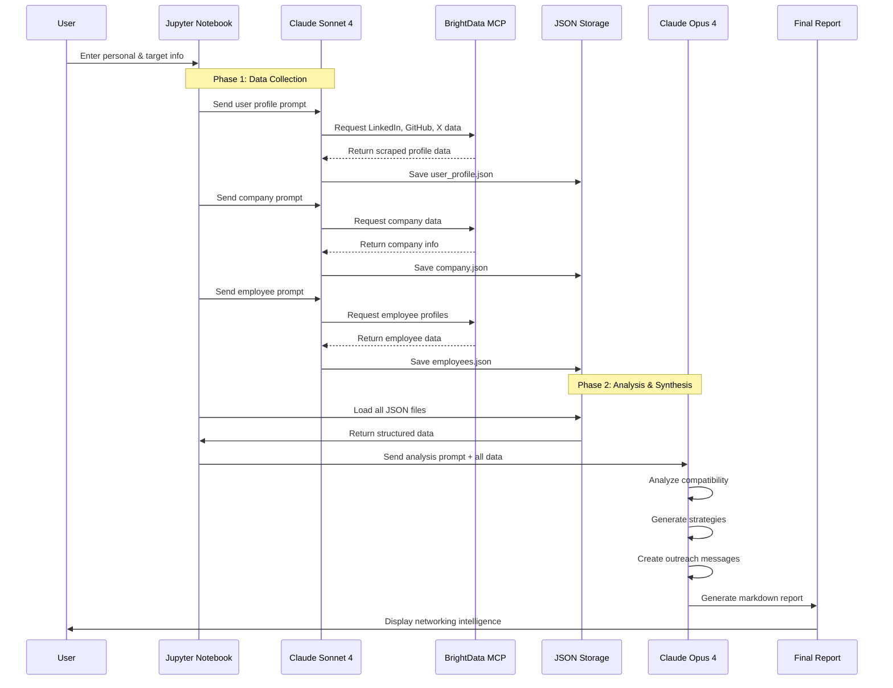

# Strategic Networking Intelligence with Claude MCP & BrightData

## Quick Overview

This demo showcases Claude's advanced capabilities by building an intelligent networking assistant that:
- **Collects** comprehensive professional data from multiple platforms via BrightData's MCP server
- **Analyzes** career compatibility using Claude's deep reasoning capabilities
- **Generates** personalized networking strategies and outreach messages

> NOTE: All the data being collected using the MCP server is public data that anyone has access to.

### System Architecture

This is the fine-grained view of how this demo is setup and works.



### Why It's Compelling

Traditional networking is often random and inefficient. This tool demonstrates how AI can:
- Identify high-value connections based on actual compatibility metrics
- Craft personalized outreach that resonates
- Save hours of manual research and analysis
- Turn networking from a numbers game into strategic relationship building

## Setup & Running Instructions

### Prerequisites
- Python 3.10+
- Anthropic API key
- BrightData account with API token

### Installation

1. **Clone the repository**
   ```bash
   git clone https://github.com/tonykipkemboi/anthropic_mcp_connector.git
   cd anthropic_mcp_connector
   ```

2. **Create and activate virtual environment**
   ```bash
   python -m venv .venv
   source .venv/bin/activate  # On Windows: .venv\Scripts\activate
   ```

3. **Configure environment variables**
   ```bash
   # Create .env file
   ANTHROPIC_API_KEY=your_anthropic_api_key
   BRIGHTDATA_TOKEN=your_brightdata_token
   ```

### Running the Demo

1. **Open Jupyter Notebook**
   ```bash
   jupyter notebook mcp_connector_demo.ipynb
   ```

2. **Update user and target information** in the configuration cells

3. **Run all cells** to generate your networking intelligence report

## Technical Approach & Architecture

### Key Architectural Decisions

1. **MCP Integration Pattern**
   - Direct connection to BrightData's MCP server via Claude's beta MCP client
   - Streamable HTTP for efficient data transfer
   - Structured JSON data storage for analysis pipeline

2. **Three-Phase Data Pipeline**
   ```
   Collection → Analysis → Synthesis
   ↓            ↓           ↓
   MCP Server   JSON Files  Claude Opus
   ```

3. **Prompt Engineering Strategy**
   - Role-based prompts for specialized data extraction
   - XML-structured prompts following Anthropic best practices
   - Explicit output schemas for consistent JSON responses

4. **Model Selection**
   - **Claude Sonnet 4** for data collection (fast, efficient)
   - **Claude Opus 4** for final analysis (maximum intelligence)

### Data Flow Sequence



## Why This Demonstration?

I chose strategic networking because it:
- **Solves a potential real problem** everyone faces at some point in their career
- **Showcases multiple Claude capabilities**: data extraction, analysis, and creative writing
- **Demonstrates practical MCP usage** beyond simple queries
- **Highlights AI's ability** to find non-obvious patterns and connections

## How This Helps Developers Understand Claude's Potential

This demo illustrates:

1. **Advanced Integration Capabilities**
   - MCP server connections for external data access
   - Multi-model orchestration (Sonnet for speed, Opus for depth)
   - Structured data handling with JSON

2. **Sophisticated Reasoning**
   - Pattern matching across multiple data sources
   - Contextual understanding of professional relationships
   - Nuanced content generation (personalized messages)

3. **Practical AI Applications**
   - Moving beyond chatbots to decision support systems
   - Combining data collection with intelligent analysis
   - Creating actionable business intelligence

## What Makes Other Builders Want to Learn More

- **End-to-end implementation** of a complex AI system
- **Real-world use case** with immediate practical value
- **Extensible architecture** that can be adapted for:
  - Sales intelligence
  - Recruitment automation
  - Market research
  - Competitive analysis
- **Production-ready patterns** for error handling and data validation

## How I Used Claude in Creating This Demo

### Prompt Engineering Journey

1. **Initial Exploration**
   - Used Claude to research MCP documentation and best practices
   - Created specialized claude-api-expert subagent for API guidance

2. **Iterative Refinement**
   - Started with basic prompts, refined based on output quality
   - Discovered optimal XML structure through experimentation
   - Learned to balance detail vs. conciseness in prompts

3. **Key Insights from Claude**
   - Importance of role definition in prompts
   - Using structured output formats for consistency
   - Breaking complex tasks into specialized sub-prompts

### Development Assistance

Here's an overview of what I used Claude for help in building this demo:
- Claude helped optimize error handling patterns
- Provided best practices for prompt structure
- Suggested architectural improvements
- Reviewed code

I specifically created a subagent in the beginning using Claude code that was an expert of Claude API docs to help with troubleshooting errors.
I also asked Claude to log all my prompts and interactions in this [file](conversation_log.md) so I don't have to remember what I prompted and also for traceability.
I realized this could be even more nuanced down to timestamps for each and the outputs it generated in response to my prompts.
Feel free to inspect the conversation logs to see how I built it from the first prompt to the last one. The goal was to use Claude as a collaborator. 
I come with an idea and start working on it and Claude helps me accelerate my workflow and also quality.

## Future Improvements

Given more time, I would add:

1. **Enhanced Data Sources**
   - Integration with more platforms (Instagram, personal websites, e.t.c.)
   - Historical data analysis for trend identification

2. **Advanced Analytics**
   - Graph visualization of professional networks
   - Predictive modeling for connection success rates
   - Sentiment analysis of public communications

3. **Automation Features**
   - Scheduled data refreshes
   - Automated outreach campaigns
   - Follow-up tracking and reminders

4. **UI/UX Improvements**
   - Web interface instead of Jupyter notebook
   - Interactive filtering and sorting
   - Export to CRM systems

5. **Security & Privacy**
   - Data encryption at rest
   - User consent workflows
   - GDPR compliance features

There's also an option to expand this to other use cases but a UI would be nice for devs to spin it up easily and even put it in prod as a template.

## Example Output

The system generates comprehensive reports including:
- Ranked list of strategic connections
- Personalized outreach messages
- Conversation starters based on shared interests
- Tactical networking timeline
- Success metrics and tracking

See a full output example here in root directory -> [networking_analysis_20250803_132612.md](networking_analysis_20250803_132612.md)

## Contributing

This demo is meant to inspire and educate. Feel free to:
- Fork and extend for your use cases
- Submit PRs with improvements
- Share your networking success stories
- Suggest new data sources or analysis features

---

Built with ❤️ by Tony Kipkemboi in collaboration with Claude, showcasing the future of AI-powered professional intelligence.